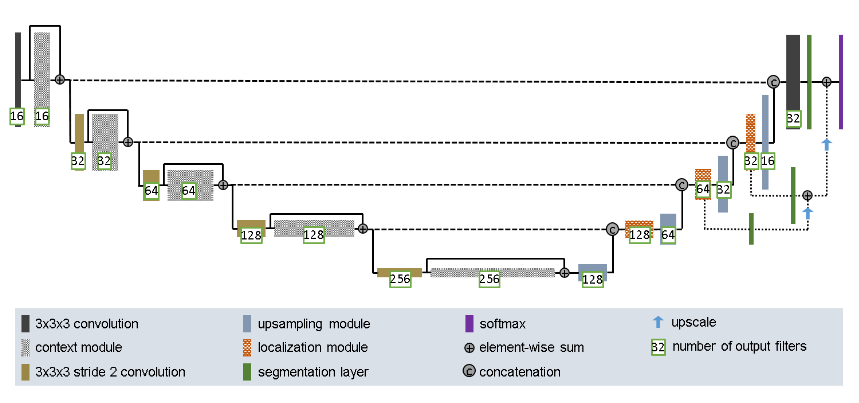
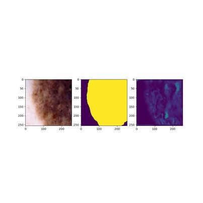
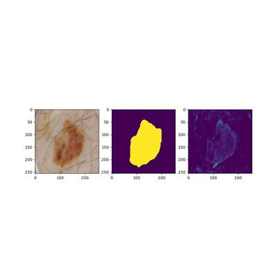

# TASK 1: Improved UNet for Image Segmentation

This project used an Improved UNet model on a segmentation problem for the ISIC melanoma dataset. This architecture was presented by [Isensee et al.](https://arxiv.org/pdf/1802.10508v1.pdf) [1], as a better alternative to the standard UNet structure.

# Dataset
The [ISIC 2017/18](https://challenge.isic-archive.com/data/#2017) dataset is a collection of skin lesion images, with associated segmentations and diagnoses. It is already split into training, validation and test subsets. A custom Dataset class was created to handle these images; it takes the image directory, matches the images to their corresponding mask and then transforms them. In this instance, the images were resized to (256,256), both due to memory requirements as well as simplicity in model (since it is a power of 2).

# Dependencies
A `conda` environment was created with the following packages:
```
pytorch
torchvision
matplotlib
pandas
```

# Model
This section explains the general structure of Improved UNet, along with the motivation behind it.
## Problem
Automatic segmentation is very useful within medical image processing; it allows areas of interest to be highlighted for further investigation. Improved UNet enhances the performance of regular UNet through various tricks, such as localisation and multi-layer segmentation. Furthermore, it uses a Dice-coefficient based loss function, which reinforces the predicted mask's area compared the ground truth's. This increases its accuracy, hence improving its segmentation capabilities.

## Structure
The Improved UNet model was constructed as outlined by [1], diagram given below:


This required the development of several additional blocks.

### Context
This context is described as a pre-activation residual block, basically two convolutions with a dropout layer inbetween.

### Localisation
This localisation block transfers encoded low spatial resolution information into a higher spatial resolution. In essence, it recombines the upsampled features with the saved outputs from the corresponding context block.

### Segmentation
Segmentation occurs at multiple levels, reducing the feature map back into one feature. This improves the accuracy of the model, as opposed to only performing segmentation on the final output.

# Results
Due to the model size and difficulties in accessing the Rangpur computing cluster, this model was difficult to train. This necessitated some changes: BCELoss() was used instead of DiceLoss due to Dice's relatively slow convergence, and the recommended 300 epochs was not feasible. With more time and computing power, the results are obviously expected to improve.

To get some initial results, the model was simply trained on the validation dataset, purely due to its reduced size. Two sample outputs are given below after 50 epochs of training, demonstrating some feasibility in the model - it does detect some of the mole's shape.



# References
[1] Isensee, F., Kickingereder, P., Wick, W., Bendszus, M., and Maier-Hein, K. "Brain Tumor Segmentation and Radiomics Survival Prediction: Contribution to the BRATS 2017 Challenge". Feb 28, 2018. Accessed from <https://arxiv.org/pdf/1802.10508v1.pdf>